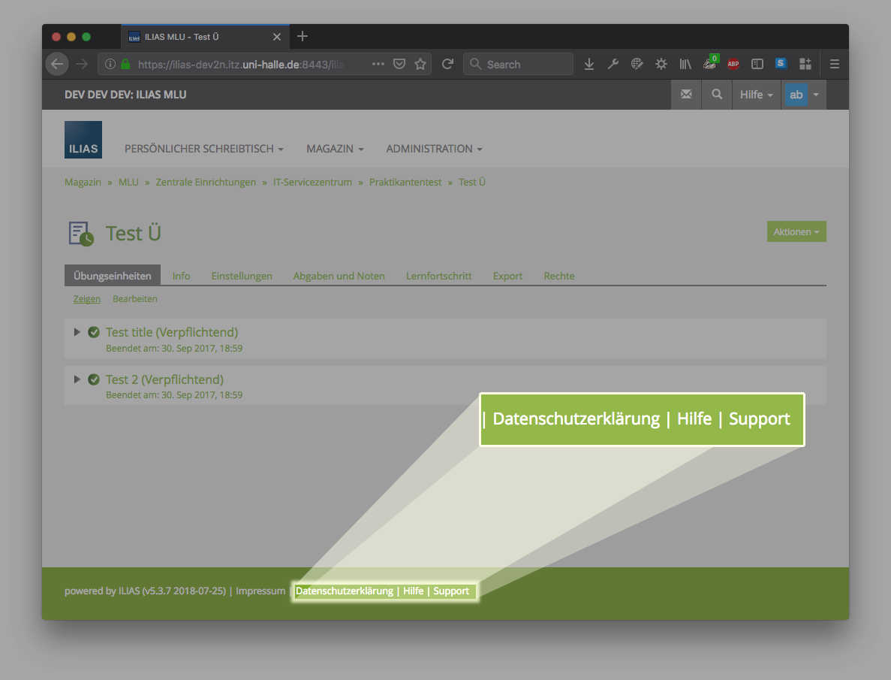

# AddFooterLink

Allows ILIAS adminstrators add links to the footer of every page through user interface.

* Does not depend on template/ theme changes.
* Different links for different user languages possible. In fact, you define a link for a language only.
* Useful, e.g. for help / GDPR / privacy policy links (Hilfe, DSGVO, Datenschutzerklärung)
* Mind that you can achieve the same without a plugin, editing the style templates, and for a "support" link ILIAS provides built-in features.

Result:



## Copyright

This work is based on [`studer-raimann/SystemNotifications`](https://github.com/studer-raimann/SystemNotifications/) by studer + raimann ag (Fabian Schmid, Martin Studer, Theodor Truffer, Michael Herren, Stefan Wanzenried, fwyss-srag). Some parts: Copyright (c) 1998-2010 ILIAS open source, Extended GPL, see docs/LICENSE.

The idea for the plugin came from Mohammed Helwani.

Reply by studer + raimann ag (JIRA 1385):

> Alle unsere[r] Plugins sind unter der GNUv3 veröffentlich[t]

Likewise, you can use this plugin under GNUv3.

## Installation

Start at your ILIAS root directory

```bash
mkdir -p Customizing/global/plugins/Services/UIComponent/UserInterfaceHook/
cd Customizing/global/plugins/Services/UIComponent/UserInterfaceHook/
git clone https://github.com/pawohl/ILIAS-plugin-AddFooterLink.git
```

As ILIAS administrator go to `Administration → Plugins` and install/activate the plugin.

## Usage / Configuration

As ILIAS administrator go to `Administration → Plugins → AddFooterLink → Actions → Configure`. From there, you can manage the footer links.


N.b., there is no language fallback mechanism. Only footer links matching the user's language choice are displayed. This allows you on the other hand adding different links for differnt languages.

## ILIAS Plugin SLA

Ich liebe und lebe die Philosophie von open soure Software! Setzen Sie dieses Plugin professionell ein? Sichern Sie sich mittels SLA die termingerechte Verfügbarkeit des Plugins auch für die kommenden ILIAS Versionen. Informieren Sie sich hierzu unter https://wohlpa.de/

## Pull-requests

I happily accept pull-requests, e.g. for more translations. For a new translation, you can also just open an issue. Use one of the sources from (`/lang`) as a template for your translation.
